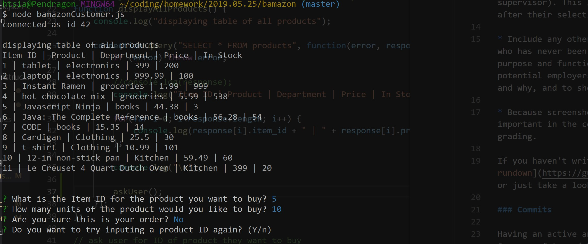

## READ ME

Upon running the program, the product table displays. The inquirer npm then runs and asks the first question.

If you don't confirm your order, the CLI asks if you want to try again.

If you select 'no,' the CLI terminates.

If you select 'yes,' the inquirer runs again and asks you what product you want to purchase and in what amount.

When you confirm your order, the program checks the amount you want to order compared to the amount in stock. If not enough product is in stock, the program terminates with the message 'Insufficient quantity!'

If there is enough product in stock, the order is fulfilled. The program logs the total cost of the order and displays the updated product quantity.
